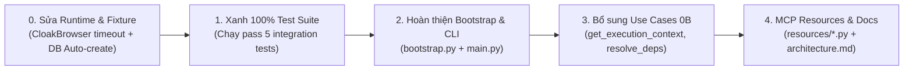

Khi **tạm bỏ qua Android (Phase 6)** và tập trung toàn lực vào luồng **Browser Reverse-Engineering**, mục tiêu cốt lõi của hệ thống là:
> **Capture từ Browser $\rightarrow$ Chuẩn hóa Event $\rightarrow$ Dựng Đồ thị Lineage $\rightarrow$ Phân tích nguồn gốc tham số / Sai khác đa phiên $\rightarrow$ Cung cấp MCP Tools cho LLM $\rightarrow$ Replay & Tự động sinh mã nguồn.**

Dưới đây là danh sách chi tiết các **tính năng cần hoàn thiện** và **kế hoạch kiểm thử** được phân loại theo mức độ ưu tiên.

---

## 1. Khắc phục lỗi nền tảng & Runtime (P0 - Cần xử lý ngay)

Trước khi bổ sung tính năng mới, cần giải quyết các điểm nghẽn khiến bộ test và runtime bị gián đoạn:

| Hạng mục | Vấn đề hiện tại | Giải pháp triển khai |
| :--- | :--- | :--- |
| **CloakBrowser Hang trên Windows** | Trong [browser_session.py](file:///d:/source_code/mcp_serve_reverse/app/adapters/browser/browser_session.py#L133-L146), `launch_async` bị treo vô hạn khi chưa tải được binary C++, khiến Playwright không rơi vào nhánh `except Exception` và làm test bị đơ. | Thêm cờ cấu hình `USE_CLOAKBROWSER=false` (mặc định cho Windows dev/test) hoặc bọc `asyncio.wait_for(launch_async(...), timeout=3.0)` để fallback ngay lập tức sang Playwright Chromium tiêu chuẩn. |
| **Khởi tạo Database tự động** | Chạy test gặp lỗi `sqlite3.OperationalError: no such table: sessions` nếu chưa gõ lệnh `alembic upgrade head`. | Tạo fixture [tests/conftest.py](file:///d:/source_code/mcp_serve_reverse/tests/conftest.py) tự động gọi `Base.metadata.create_all(bind=async_engine)` trước khi chạy test suite. |
| **Async Callbacks trong NetworkMapper** | Trong [browser_session.py](file:///d:/source_code/mcp_serve_reverse/app/adapters/browser/browser_session.py#L217-L218), `page.on("request", lambda req: net_mapper.on_request(req))` gọi hàm `async` mà không await/create_task. | Sử dụng `page.on("request", lambda req: asyncio.create_task(net_mapper.on_request(req)))` để không bỏ sót sự kiện mạng. |

---

## 2. Các tính năng cần triển khai theo từng Phase

### Phase 1: Browser Capture & Event Store
*Hiện trạng: Đã có core Playwright, 7 script JS hooks, pre-seed state, redaction token.*

1. **Cấu hình Capture Options linh hoạt**:
   - Hiện tại luôn cấy toàn bộ 7 script JS. Cần đọc `capture_options` (ví dụ: `network`, `storage`, `crypto`, `runtime`) từ use case [start_session.py](file:///d:/source_code/mcp_serve_reverse/app/application/capture/start_session.py) để chỉ kích hoạt các hook cần thiết, giảm overhead trình duyệt.
2. **Hỗ trợ Multi-Page / Iframe Tracking**:
   - Lắng nghe sự kiện `context.on("page")` và `page.on("framenavigated")` để gán chính xác `page_id` và `frame_id` cho các event phát sinh từ tab mới hoặc popup OAuth/Login.
3. **Chụp ảnh màn hình (Screenshot Artifact)**:
   - Thêm tính năng chụp màn hình tự động khi có lỗi mạng hoặc khi kết thúc session nếu `save_screenshots=True`.

---

### Phase 2: Graph Projection
*Hiện trạng: Đã có `graph_projector.py` rất chi tiết, `stack_parser.py`, các domain nodes/edges.*

1. **Incremental / Streaming Event Projection ([project_event.py](file:///d:/source_code/mcp_serve_reverse/app/application/graph/project_event.py))**:
   - Hiện file đang 0 bytes. Cần viết logic chiếu từng event ngay khi vừa ingest thay vì chỉ chờ session đóng mới project toàn bộ.
2. **Rebuild Graph Use Case ([rebuild_graph.py](file:///d:/source_code/mcp_serve_reverse/app/application/graph/rebuild_graph.py))**:
   - Hiện file đang 0 bytes. Cần triển khai tính năng xóa graph cũ của một session và đọc lại toàn bộ `trace_events` gốc từ SQLite để chiếu lại khi cập nhật luật trích xuất quan hệ.
3. **Graph Compaction & Pruning ([compact_graph.py](file:///d:/source_code/mcp_serve_reverse/app/application/graph/compact_graph.py))**:
   - Hiện file đang 0 bytes. Cần thuật toán lọc bỏ các node "nhiễu" không mang giá trị đảo ngược (ví dụ: request tải file tĩnh `.png`, `.css`, các hàm nội bộ của thư viện frontend không liên quan đến payload).

---

### Phase 3: Lineage & Differential Analysis
*Hiện trạng: Đã có `trace_origin.py`, `differential_analysis.py`, `generate_replay_spec.py`.*

1. **Phân tích chuỗi biến đổi dữ liệu ([find_transformations.py](file:///d:/source_code/mcp_serve_reverse/app/application/lineage/find_transformations.py))**:
   - Hiện file đang 0 bytes. Cần phân tích chuỗi các hàm biến đổi liên tiếp (ví dụ: `raw_string` $\rightarrow$ `JSON.stringify` $\rightarrow$ `crypto.subtle.digest` $\rightarrow$ `base64/hex` $\rightarrow$ Header/Body).
2. **Truy xuất ngữ cảnh thực thi hàm ([get_execution_context.py](file:///d:/source_code/mcp_serve_reverse/app/application/trace/get_execution_context.py))**:
   - Hiện file đang 0 bytes. Cần hỗ trợ lấy toàn bộ cây gọi hàm (caller/callee tree), arguments, return value và các request lân cận xung quanh một `execution_id`.

---

### Phase 4: MCP Query Layer & Resources
*Hiện trạng: Đã đăng ký đủ 18 MCP tools trong [server.py](file:///d:/source_code/mcp_serve_reverse/app/interfaces/mcp/server.py).*

1. **Triển khai MCP Resources ([interfaces/mcp/resources/](file:///d:/source_code/mcp_serve_reverse/app/interfaces/mcp/resources))**:
   - [x] Đã hoàn thành và đăng ký vào MCP Server:
     - [session_resource.py](file:///d:/source_code/mcp_serve_reverse/app/interfaces/mcp/resources/session_resource.py): `session://{session_id}` $\rightarrow$ Trả về metadata và tóm tắt session.
     - [request_resource.py](file:///d:/source_code/mcp_serve_reverse/app/interfaces/mcp/resources/request_resource.py): `request://{session_id}/{request_id}` $\rightarrow$ Chi tiết request, response và lineage tóm tắt.
     - [lineage_resource.py](file:///d:/source_code/mcp_serve_reverse/app/interfaces/mcp/resources/lineage_resource.py): `lineage://{session_id}/{node_id}` $\rightarrow$ Cây nguồn gốc của một giá trị.
2. **Context Reduction & Truncation Guard ([context.py](file:///d:/source_code/mcp_serve_reverse/app/interfaces/mcp/context.py))**:
   - [x] Đã hoàn thành: Giới hạn kích thước payload trả về cho LLM (cắt ngắn response body quá dài, phân trang rõ ràng, gắn cờ `truncated: true`).

---

### Phase 5: Replay Engine & Code Synthesis
*Hiện trạng: ĐÃ HOÀN THIỆN TOÀN BỘ (Passed 100% test suite)*

1. **Giải quyết phụ thuộc tuần tự ([resolve_dependencies.py](file:///d:/source_code/mcp_serve_reverse/app/application/replay/resolve_dependencies.py))**:
   - [x] Đã hoàn thành (244 lines). Khi replay một request `POST /api/action` có phụ thuộc token/cookie từ `POST /api/login`, use case này tự động phân tích lịch sử HTTP, phát hiện request tiền đề, trích xuất extraction rules, lập Execution Plan và hỗ trợ `auto_execute_prerequisites=True` để lấy token tươi mới.
   - [x] Tích hợp trực tiếp vào `ExecuteReplayUseCase` và expose MCP tool `resolve_dependencies`.
2. **Kiểm tra chính sách an toàn Replay ([validate_replay.py](file:///d:/source_code/mcp_serve_reverse/app/application/replay/validate_replay.py))**:
   - [x] Đã hoàn thành (99 lines). Kiểm tra whitelist domain, chặn các phương thức nhạy cảm khi `allow_mutation=False`, rà soát placeholder chưa thay thế (`{{...}}`) và chặn rò rỉ secret chưa cấu hình (`[REDACTED:...]`).
   - [x] Tích hợp tự động vào `ExecuteReplayUseCase` trước khi gửi request và expose MCP tool `validate_replay`.

---

### Hạ tầng, Wiring & Entrypoint
1. **Composition Root ([app/bootstrap.py](file:///d:/source_code/mcp_serve_reverse/app/bootstrap.py))**:
   - Đang 0 bytes. Cần tạo hàm `bootstrap_container()` khởi tạo và gắn kết tự động: Repositories $\rightarrow$ Use Cases $\rightarrow$ MCP Server.
2. **CLI Entrypoint ([app/main.py](file:///d:/source_code/mcp_serve_reverse/app/main.py))**:
   - Đang 0 bytes. Viết CLI hỗ trợ lệnh chạy MCP server stdio (`python -m app.main run-mcp`) hoặc chạy capture thủ công từ terminal (`python -m app.main capture --target ...`).
3. **Hoàn thiện tài liệu [docs/architecture.md](file:///d:/source_code/mcp_serve_reverse/docs/architecture.md)**:
   - File đang 0 bytes. Cần tổng hợp sơ đồ kiến trúc tổng thể, luồng dữ liệu của 5 phase cho Browser.

---

## 3. Kế hoạch & Kịch bản Kiểm thử (Testing Plan)

Để đảm bảo hệ thống ổn định và kiểm thử được 100% tự động, cần triển khai các nhóm test sau:

### 3.1. Unit Tests (Chạy nhanh, không cần mở Browser)
Cần hoàn thiện 3 file unit test đang bị bỏ trống (0 bytes):
1. **[tests/domain/test_graph.py](file:///d:/source_code/mcp_serve_reverse/tests/domain/test_graph.py)**:
   - Kiểm tra tạo `GraphNode`, `GraphEdge`, kiểm tra tính hợp lệ của `NodeType` và `RelationType`.
   - Kiểm tra thêm/xóa cạnh, kiểm tra quan hệ nguồn và đích.
2. **[tests/domain/test_lineage.py](file:///d:/source_code/mcp_serve_reverse/tests/domain/test_lineage.py)**:
   - Kiểm tra thuật toán phân loại tham số (`classify_parameter`): kiểm tra dữ liệu cố định $\rightarrow$ `STATIC`, dữ liệu thay đổi theo payload $\rightarrow$ `USER_INPUT`, timestamp $\rightarrow$ `TIME_DEPENDENT`.
   - Kiểm tra thuật toán BFS duyệt ngược tìm node gốc (`ValueNode`, `StorageNode`).
3. **[tests/domain/test_provenance.py](file:///d:/source_code/mcp_serve_reverse/tests/domain/test_provenance.py)**:
   - Kiểm tra gán nhãn `observed` vs `inferred`.
   - Kiểm tra tính toán điểm tin cậy `confidence` (ví dụ: có `stack_trace` + `hash_match` $\rightarrow$ confidence $\ge 0.9$).
4. **Unit test cho Code Synthesizer**:
   - Kiểm tra `code_synthesizer.py` sinh đúng cú pháp Python `httpx`, cURL bash command và TypeScript `fetch` khi truyền headers/body/variables.

### 3.2. Integration Tests (Mô phỏng luồng Browser E2E)
Đảm bảo 5 file test tích hợp sau chạy pass 100% với Playwright headless:

```
tests/
├── test_phase1_capture.py              # Đã có kịch bản đổi tên 2 phiên với Pre-seed state
├── test_phase2_lineage.py              # Đã có kịch bản dựng Graph & phát hiện quan hệ
├── test_phase3_replay_synthesis.py     # Đã có kịch bản Replay spec & sinh mã Python/cURL
├── test_phase4_mcp_query_layer.py      # Đã có kịch bản test 18 MCP Tools gọi từ MCP Client
└── test_pre_post_request_graph.py      # Đã có kịch bản trace các hàm gọi trước & sau fetch
```

**Các kịch bản E2E kiểm thử chi tiết:**
- **Kịch bản 1: Pre-seed & Auth Token Lineage**:
  - Pre-seed `auth_token` vào `localStorage`.
  - Browser thực hiện request đọc token từ storage và đính kèm vào header `Authorization: Bearer <token>`.
  - *Kỳ vọng kiểm thử*: Graph sinh ra cạnh `StorageOperation (localStorage.auth_token) -> READS_FROM -> Function Execution -> ATTACHES_TO -> NetworkRequest`. Header trong DB phải được redact SHA-256.
- **Kịch bản 2: Differential Analysis (Phát hiện Signature/Dynamic Nonce)**:
  - Chạy Session A với input `name="Nguyen An"`, Session B với `name="Tran Binh"`.
  - Cả 2 session đều gửi kèm `timestamp` và `hash_sign`.
  - *Kỳ vọng kiểm thử*: `DifferentialAnalysisUseCase` nhận diện đúng `name` là `USER_INPUT`, `timestamp` là `TIME_DEPENDENT`, và `device_id` (nếu có) là `STATIC`.
- **Kịch bản 3: Replay Dry Run & Live Execution**:
  - Replay lại request của Session 1 bằng biến mới (`name="Le Cuong"`).
  - So sánh mã trạng thái HTTP 200 trả về và body nhận được so với response gốc.
- **Kịch bản 4: MCP Client Query**:
  - Khởi tạo client gọi tool `trace_origin(param_name="Authorization")`.
  - Nhận về kết quả chỉ ra nguồn gốc từ `localStorage.auth_token` với `confidence >= 0.8`.

---

## 4. Lộ trình thực hiện khuyến nghị (Roadmap)



1. **Bước 1**: Sửa cơ chế fallback CloakBrowser trong [browser_session.py](file:///d:/source_code/mcp_serve_reverse/app/adapters/browser/browser_session.py) và thêm auto-create table trong [conftest.py](file:///d:/source_code/mcp_serve_reverse/tests/conftest.py). Chạy để **5 file test E2E hiện có đều pass 100%**.
2. **Bước 2**: Viết mã nguồn cho [app/bootstrap.py](file:///d:/source_code/mcp_serve_reverse/app/bootstrap.py) và [app/main.py](file:///d:/source_code/mcp_serve_reverse/app/main.py) để có entrypoint chuẩn chạy MCP Server.
3. **Bước 3**: Lấp đầy các use case còn thiếu ([get_execution_context.py](file:///d:/source_code/mcp_serve_reverse/app/application/trace/get_execution_context.py), [find_transformations.py](file:///d:/source_code/mcp_serve_reverse/app/application/lineage/find_transformations.py), [resolve_dependencies.py](file:///d:/source_code/mcp_serve_reverse/app/application/replay/resolve_dependencies.py)).
4. **Bước 4**: Viết unit test cho [tests/domain/](file:///d:/source_code/mcp_serve_reverse/tests/domain), MCP Resources và điền tài liệu [docs/architecture.md](file:///d:/source_code/mcp_serve_reverse/docs/architecture.md).


Viewed 001_road_map.md:1-152
Viewed server.py:1-160
Viewed server.py:161-300
Viewed server.py:301-463
Viewed graph.py:1-90
Listed directory application
Listed directory graph
Listed directory lineage
Viewed lineage.py:1-100
Viewed lineage.py:101-146
Viewed differential_analysis.py:1-60
Viewed generate_replay_spec.py:1-60
Viewed replay.py:1-60
Listed directory replay
Viewed compare_responses.py:1-60
Viewed execute_replay.py:1-60
Listed directory trace
Listed directory network
Listed directory ingest
Viewed capture.py:1-90
Viewed session_repository.py:1-60
Viewed session_repository.py:61-166
Viewed network.py:1-126
Ran command: `python -c "import mcp.server.mcpserver; print(dir(mcp.server.mcpserver.MCPServer))"`
Ran command: `uv run python -c "import mcp.server.mcpserver; print(dir(mcp.server.mcpserver.MCPServer))"`
Viewed test_phase4_mcp_query_layer.py:1-70

Sau khi rà soát toàn bộ 23 MCP Tools và 3 MCP Resources hiện có so với kiến trúc 5 Phase và các use case trong codebase, hệ thống đã phủ rất tốt các luồng phân tích sâu. Tuy nhiên, **vẫn còn một số điểm thiếu sót và điểm mở rộng quan trọng** để trải nghiệm của một Agent LLM (như Claude, Antigravity, Cursor) đạt mức hoàn hảo:

---

### 1. Thiếu các Tool Khám phá & Điều hướng Dữ liệu (Discovery Tools) — *Điểm thiếu quan trọng nhất*

Hiện tại, hầu hết các tool đều yêu cầu Agent phải biết trước `session_id` hoặc `request_id`. Nếu một người dùng mới mở chat và nói *"Hãy phân tích cho tôi các request trong phiên capture gần nhất"*, Agent sẽ bị lúng túng vì:
- ❌ **Chưa có tool `list_sessions`**: Không có cách nào để LLM liệt kê danh sách các phiên capture trong database (kèm metadata: URL mục tiêu, thời gian bắt đầu, số lượng event, status).
- ❌ **Chưa có tool `list_requests`**: Một session có thể bắt hàng trăm request (ảnh, css, xhr, fetch). Hiện tại LLM chỉ có thể gọi `search_trace_events` thô rất tốn context window, hoặc phải biết trước `request_id` mới gọi được `summarize_request`. Tool `list_requests(session_id, method, url_keyword, limit)` sẽ giúp LLM lọc nhanh ra các API JSON/XHR cốt lõi cần mổ xẻ.

---

### 2. Các Use Case nghiệp vụ lõi đã triển khai nhưng CHƯA phơi ra (expose) thành MCP Tool

Trong tầng `app/application/`, chúng ta đã viết các use case rất mạnh nhưng chưa được đăng ký trong [app/interfaces/mcp/server.py](file:///d:/source_code/mcp_serve_reverse/app/interfaces/mcp/server.py):

| Use Case đã có | Tệp nguồn | Giá trị mang lại nếu expose thành MCP Tool |
| :--- | :--- | :--- |
| **`differential_analysis`** | [differential_analysis.py](file:///d:/source_code/mcp_serve_reverse/app/application/lineage/differential_analysis.py) | **Cực kỳ quan trọng**: Cho phép LLM so sánh các session của cùng một `task_id` (Session 1 tên A, Session 2 tên B) để tự động nhận diện tham số nào là `STATIC`, `TIME_DEPENDENT`, `USER_INPUT`, `HASH_SIGNATURE`. Hiện tại mới chỉ được gọi ngầm bên trong `ReplaySpec`. |
| **`rebuild_graph`** | [rebuild_graph.py](file:///d:/source_code/mcp_serve_reverse/app/application/graph/rebuild_graph.py) | Cho phép LLM yêu cầu xây dựng lại đồ thị từ SQLite raw trace events khi cập nhật heuristic hoặc sau khi capture thêm. Hiện mới chỉ có trên CLI. |
| **`compact_graph`** | [compact_graph.py](file:///d:/source_code/mcp_serve_reverse/app/application/graph/compact_graph.py) | Cho phép LLM chủ động lọc bỏ các node rác (file tĩnh `.png`, `.css`, các node cô lập) trước khi truy vấn đồ thị để tránh tràn context window. |

---

### 3. Thiếu Tool Trực quan hóa Đồ thị (Graph Visualization / Export)

- Khi Agent phân tích đường dẫn nguồn gốc dữ liệu (lineage path), kết quả hiện trả về dạng JSON các node/edge.
- Nếu bổ sung thêm tool **`export_lineage_graph(session_id, target_node_id, format="mermaid")`**, LLM có thể sinh ra ngay một khối biểu đồ Mermaid trực quan để hiển thị trực tiếp trong khung chat cho người dùng thấy luồng biến đổi: `localStorage -> Function -> SubtleCrypto -> Header`.

---

### 4. Thiếu chuẩn mở rộng MCP: MCP Prompts & Server Instructions

Giao thức MCP tiêu chuẩn không chỉ hỗ trợ **Tools** và **Resources**, mà còn có:
1. **`instructions` (System Prompt cho MCP Server)**:
   - Hiện tại server chưa truyền tham số `instructions` vào `MCPServer("api_lineage", instructions=...)`. Khi Client kết nối, nếu có `instructions`, Agent sẽ được hướng dẫn tự động quy trình chuẩn (ví dụ: `list_sessions` $\rightarrow$ `list_requests` $\rightarrow$ `summarize_request` $\rightarrow$ `trace_origin` $\rightarrow$ `synthesize_code`).
2. **MCP Prompts (`@server.prompt()`)**:
   - Định nghĩa các prompt mẫu tích hợp sẵn để người dùng kích hoạt nhanh từ giao diện:
     - `reverse_api_workflow(session_id, request_id)`: Template hướng dẫn Agent đảo ngược một endpoint từ A-Z.
     - `signature_analysis_workflow(session_id, header_name)`: Template chuyên dụng bóc tách chữ ký/token mã hóa (Web Crypto/WASM).

---

### 💡 Đề xuất triển khai tiếp theo:
Nếu bạn đồng ý, tôi có thể triển khai bổ sung ngay gói **"MCP Completeness Pack"** gồm:
1. Thêm **`list_sessions`** & **`list_requests`** (Discovery).
2. Expose **`differential_analysis`**, **`rebuild_graph`**, **`compact_graph`** (Core Use Cases).
3. Thêm tool **`export_lineage_graph`** (Xuất sơ đồ Mermaid trực quan).
4. Thiết lập **`instructions`** và các **MCP Prompts** mẫu theo chuẩn Model Context Protocol.

Bạn có muốn tôi tiến hành cập nhật bổ sung các công cụ này luôn không?