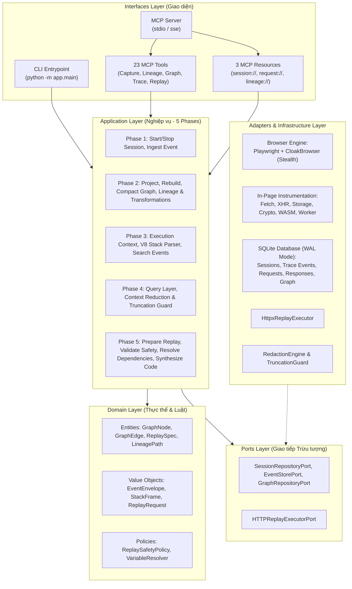
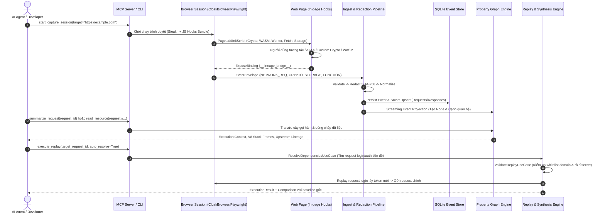

# MCP Serve Reverse: Kiến trúc Kỹ thuật Toàn diện (System Architecture)

Hệ thống **MCP Serve Reverse** (`api_lineage`) là nền tảng phân tích động (Dynamic Reverse-Engineering) và truy vết nguồn gốc dòng dữ liệu (Data Lineage Engine) dành cho ứng dụng Web. Hệ thống cung cấp giao diện chuẩn **Model Context Protocol (MCP)** kết nối trực tiếp với các Agent AI (như Antigravity, Claude Desktop, Cursor) để tự động giải mã chữ ký API, truy vết token/cookie, kiểm tra bảo mật và sinh mã tái hiện request (Replay Engine).

---

## 1. Sơ đồ Kiến trúc Tổng thể (Hexagonal / Clean Architecture)

Hệ thống được thiết kế theo mô hình **Ports & Adapters (Hexagonal Architecture)** kết hợp với **Clean Architecture**, phân tách nghiêm ngặt giữa nghiệp vụ cốt lõi và các thư viện ngoại vi:

---

## 2. Luồng Dữ liệu Toàn trình (5-Phase End-to-End Data Flow)

---

## 3. Chi tiết Chuyên sâu 5 Phân hệ (The 5 Phases)

### Phase 1: Browser Capture & Event Store
1. **Bộ đôi Động cơ Trình duyệt (Dual Browser Engine)**:
   - **CloakBrowser**: Tích hợp chống phát hiện bot mức nhân (anti-detect fingerprints, patched V8 bindings, canvas/webgl noise, stealth headless).
   - **Playwright Fallback**: Tự động chuyển đổi mượt mà sang Playwright chuẩn nếu môi trường không có bản nhị phân CloakBrowser.
2. **Hệ thống In-Page Hooks (7 Scripts + Primitives)**:
   - `fetch.js` & `xhr.js`: Đánh chặn tất cả HTTP calls, chèn header nội bộ `x-lineage-req-id` để liên kết đồng nhất giữa JavaScript Call Stack và Network Layer của Playwright.
   - `storage.js` & `cookies.js`: Bắt mọi thao tác `localStorage`, `sessionStorage`, `document.cookie` (read, write, delete).
   - `crypto.js`: Đánh chặn WebCrypto API (`digest`, `sign`, `encrypt`, `decrypt`), CSPRNG (`getRandomValues`), low-level encoding (`TextEncoder`, `TextDecoder`, `btoa`, `atob`), WebAssembly module instantiation, và Web Worker `postMessage`.
3. **Multi-Page & Popup Tracking**:
   - Tự động cấy bridge và network listeners khi mở tab mới (`context.on("page")`) hoặc popup đăng nhập OAuth.
4. **Đồng bộ HttpOnly Cookies & Screenshot**:
   - Sử dụng `context.cookies()` truy xuất 100% cookie HttpOnly mà `document.cookie` không thể đọc được.
   - Chụp ảnh màn hình tự động lưu trữ artifact khi hoàn thành phiên.

---

### Phase 2: Property Graph Lifecycle & Lineage Engine
1. **Mô hình Đồ thị Thuộc tính (Property Graph Model)**:
   - **Nodes**: `SESSION`, `HTTP_REQUEST`, `HTTP_RESPONSE`, `FUNCTION_EXECUTION`, `STORAGE_ENTRY`, `CRYPTO_OPERATION`, `VALUE`.
   - **Edges**: `CONTAINS`, `CALLS`, `READS_FROM`, `WRITES_TO`, `DERIVED_FROM`, `USED_IN`, `FLOWS_TO`, `ASSOCIATED_WITH`.
2. **Vòng đời Đồ thị (Graph Lifecycle)**:
   - **Streaming Projection ([project_event.py](file:///d:/source_code/mcp_serve_reverse/app/application/graph/project_event.py))**: Chiếu và tạo liên kết đồ thị tức thì ngay khi nhận sự kiện.
   - **Rebuild Graph ([rebuild_graph.py](file:///d:/source_code/mcp_serve_reverse/app/application/graph/rebuild_graph.py))**: Cho phép xóa toàn bộ đồ thị và chiếu lại từ sự kiện gốc SQLite khi cập nhật quy tắc suy luận quan hệ.
   - **Graph Compaction & Pruning ([compact_graph.py](file:///d:/source_code/mcp_serve_reverse/app/application/graph/compact_graph.py))**: Tự động cắt tỉa tài nguyên tĩnh (.css, .png, font), loại bỏ tracking domains (`google-analytics`, `sentry`) và các hàm nội bộ của thư viện frontend (`__webpack_require__`).
3. **Phân tích Chuỗi Biến đổi Dữ liệu ([find_transformations.py](file:///d:/source_code/mcp_serve_reverse/app/application/lineage/find_transformations.py))**:
   - Tự động xâu chuỗi các bước biến đổi liên tiếp:
     $$\text{Raw String} \longrightarrow \text{JSON.stringify} \longrightarrow \text{crypto.subtle.digest (SHA-256)} \longrightarrow \text{Base64 / Hex} \longrightarrow \text{Header: x-signature}$$
   - Hỗ trợ duyệt cả hai chiều `forward` (xuôi dòng) và `backward` (ngược dòng).

---

### Phase 3: Function Execution Context & V8 Stack Parser
1. **Phân tích V8 Call Stack ([stack_parser.py](file:///d:/source_code/mcp_serve_reverse/app/domain/trace/stack_parser.py))**:
   - Bóc tách stack trace dạng chuỗi thành cấu trúc danh sách `StackFrame` (`function_name`, `file_url`, `line_no`, `col_no`).
   - Tự động lọc sạch các stack frame nội bộ của instrumentation script.
2. **Truy xuất Ngữ cảnh Thực thi Hàm ([get_execution_context.py](file:///d:/source_code/mcp_serve_reverse/app/application/trace/get_execution_context.py))**:
   - Cây gọi hàm phân cấp (Caller / Callee Call Tree).
   - Tham số đầu vào (arguments) và giá trị trả về (return value) có che giấu dữ liệu nhạy cảm.
   - Định vị các HTTP request do hàm trực tiếp kích hoạt hoặc diễn ra trong cửa sổ thời gian lân cận.

---

### Phase 4: MCP Query Layer & Resources
1. **Danh mục 23 MCP Tools**:
   - **Capture**: `start_capture_session`, `stop_capture_session`, `get_capture_status`.
   - **Trace**: `search_trace_events`, `get_trace_timeline`, `get_execution_context`.
   - **Graph**: `get_graph_node`, `get_graph_neighbors`, `get_graph_statistics`.
   - **Lineage**: `trace_origin`, `trace_downstream`, `explain_lineage_path`, `compare_lineage`, `find_transformations`.
   - **Network**: `summarize_request`, `analyze_request_lineage`, `find_request_dependencies`, `compare_requests`.
   - **Replay**: `prepare_replay`, `execute_replay`, `synthesize_code`, `validate_replay`, `resolve_dependencies`.
2. **Hệ thống 3 MCP Resources**:
   - `session://{session_id}`: Metadata phiên, thống kê định lượng các bảng, danh sách endpoint API và storage keys.
   - `request://{session_id}/{request_id}`: Chi tiết HTTP request/response, timing và tóm tắt phụ thuộc lineage.
   - `lineage://{session_id}/{node_id}`: Cây nguồn gốc giá trị, bằng chứng suy luận và tác động xuôi dòng.
3. **Context Reduction & Truncation Guard ([context.py](file:///d:/source_code/mcp_serve_reverse/app/interfaces/mcp/context.py))**:
   - Giới hạn độ dài chuỗi (`max_string_len=2000`) và kích thước body (`max_body_len=4000`).
   - Giới hạn số lượng phần tử mảng (`max_items=50`) và độ sâu đối tượng, gắn cờ `truncated: true` và thông điệp cảnh báo rõ ràng nhằm chống tràn bộ nhớ ngữ cảnh của LLM.

---

### Phase 5: Replay Engine & Code Synthesis
1. **Giải quyết Phụ thuộc Tuần tự ([resolve_dependencies.py](file:///d:/source_code/mcp_serve_reverse/app/application/replay/resolve_dependencies.py))**:
   - Tự động nhận diện request tiền đề sinh ra token hoặc cookie cho request kế tiếp.
   - Hỗ trợ so khớp token thô, so khớp qua mã băm của `RedactionEngine` và suy luận ngữ nghĩa (`token`, `jwt`, `authorization`).
   - Lập Kế hoạch Thực thi (Execution Plan) và trích xuất Extraction Rules.
2. **Kiểm tra Chính sách An toàn Replay ([validate_replay.py](file:///d:/source_code/mcp_serve_reverse/app/application/replay/validate_replay.py))**:
   - Whitelist Domain: Chặn các request tới host ngoài danh mục cho phép.
   - Chặn State-Mutating Methods (`POST`, `PUT`, `DELETE`) khi `allow_mutation=False`.
   - Rà soát các biến mẫu chưa được thay thế (`{{variable}}`) hoặc token chưa được nạp giá trị thực (`[REDACTED:...]`).
3. **Tự động Sinh Mã Nguồn Đa ngôn ngữ ([code_synthesizer.py](file:///d:/source_code/mcp_serve_reverse/app/domain/replay/code_synthesizer.py))**:
   - Python (`httpx.AsyncClient` hoặc `httpx.Client`)
   - cURL (Bash command)
   - TypeScript (`fetch` API kèm headers và JSON body)

---

## 4. Chính sách Bảo mật, Che giấu Dữ liệu (Security & Redaction)

1. **Che giấu Dữ liệu Nhạy cảm (Redaction Engine)**:
   - Tự động nhận diện các khóa nhạy cảm: `authorization`, `cookie`, `set-cookie`, `access_token`, `refresh_token`, `password`, `api_key`, `secret`.
   - Sử dụng cơ chế băm có Salt:
     $$\text{Masked Token} = \text{"[REDACTED:sha256:"} + \text{SHA256}(\text{value} + \text{salt})[:16] + \text{"]"}$$
   - Cho phép so khớp chính xác sự xuất hiện của cùng một token giữa các bước mà không làm lộ dữ liệu bí mật ra cơ sở dữ liệu hoặc giao diện MCP.
2. **Bảo vệ Thực thi Replay**:
   - `dry_run` là chế độ mặc định an toàn: chỉ chuẩn bị request template mà không gửi lưu lượng mạng ra ngoài.
   - Tự động kiểm tra `ValidateReplayUseCase` trước khi gửi request thật.

---

## 5. Composition Root & Giao diện Dòng lệnh (CLI)

1. **Composition Root ([app/bootstrap.py](file:///d:/source_code/mcp_serve_reverse/app/bootstrap.py))**:
   - Hàm `bootstrap_container()` khởi tạo toàn bộ 39 components (Repositories, Adapters, Use Cases, MCP Server) theo chuẩn Dependency Injection, giúp mã nguồn hoàn toàn độc lập và dễ kiểm thử.
2. **CLI Entrypoint ([app/main.py](file:///d:/source_code/mcp_serve_reverse/app/main.py))**:
   - `python -m app.main run-mcp`: Khởi chạy MCP Server stdio kết nối AI Agent.
   - `python -m app.main capture --target <url>`: Chạy phiên capture tương tác hoặc tự động.
   - `python -m app.main replay --session-id <id> --request-id <req_id> --auto-resolve`: Phát lại request từ dòng lệnh.
   - `python -m app.main graph --session-id <id> --action <stats|rebuild|compact>`: Quản trị đồ thị Property Graph.
