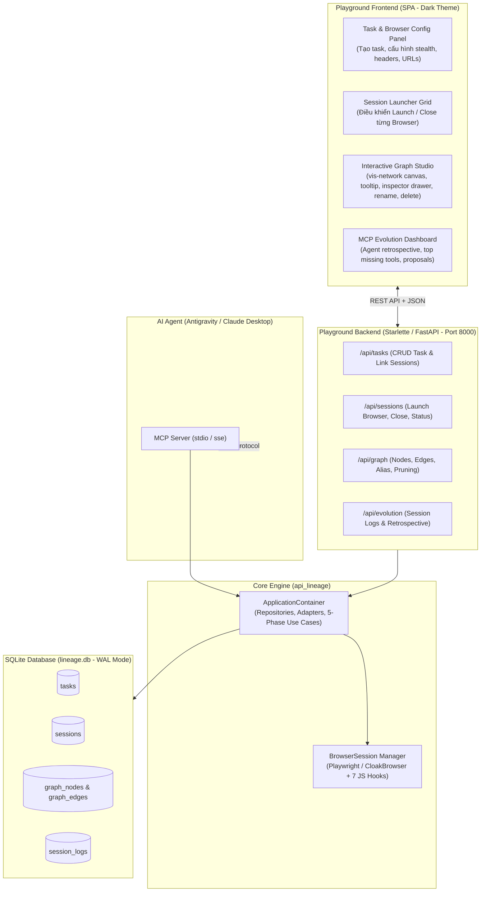

# Bản Thiết Kế Sơ Bộ Frontend & Backend Cho Playground Studio

Tài liệu này xác định kiến trúc, công nghệ và kế hoạch triển khai sơ bộ cho phân hệ **Playground Studio** nằm tại thư mục `playground/`, bao gồm:
- **`playground/backend/`**: Máy chủ API phục vụ điều khiển phiên, truy vấn đồ thị, quản lý task và ghi nhận tiến hóa MCP.
- **`playground/frontend/`**: Giao diện người dùng Web SPA (Single Page Application) hiện đại gồm: Task Configurator, Session Launcher, Interactive Graph Studio và MCP Evolution Dashboard.
- **`playground/docs/`**: Tài liệu thiết kế và đặc tả kỹ thuật.

---

## 1. Kiến trúc Tổng thể (Overall Architecture)



---

## 2. Thiết kế Backend (`playground/backend/`)

### 2.1. Ngăn xếp Công nghệ (Tech Stack)
- **Framework**: `Starlette` hoặc `FastAPI` (đã có sẵn trong môi trường Python `.venv` qua `starlette` và `uvicorn`).
- **Data Access**: Tái sử dụng trực tiếp các Use Cases và Repositories từ `app.bootstrap.bootstrap_container()` mà không viết lại logic truy vấn database.
- **CORS Middleware**: Hỗ trợ CORS linh hoạt cho phép chạy frontend độc lập hoặc được backend serve tĩnh.

### 2.2. Cấu trúc Thư mục Đề xuất
```
playground/backend/
├── main.py               # Entrypoint khởi chạy Uvicorn server
├── config.py             # Cấu hình host, port, CORS, database path
├── dependencies.py       # Dependency Injection (lấy ApplicationContainer)
├── api/
│   ├── __init__.py
│   ├── routes_tasks.py      # /api/tasks (Tạo, xem chi tiết, danh sách task)
│   ├── routes_sessions.py   # /api/sessions (Launch browser, close session, status)
│   ├── routes_graph.py      # /api/graph (Dữ liệu đồ thị cho vis-network, rename, delete)
│   └── routes_evolution.py  # /api/evolution (Báo cáo hồi cứu, tool thiếu)
└── schemas/
    ├── __init__.py
    ├── task_schemas.py      # Pydantic schemas cho Task request/response
    ├── session_schemas.py   # Pydantic schemas cho Session launch/close
    └── graph_schemas.py     # Pydantic schemas cho Graph nodes, edges, alias
```

### 2.3. Danh sách REST API Endpoints Chi tiết

| Nhóm | Phương thức | Endpoint | Mô tả |
| :--- | :--- | :--- | :--- |
| **Tasks** | `POST` | `/api/tasks` | Tạo Task mới, lưu danh sách initial URLs và tự động sinh $N$ session con |
| | `GET` | `/api/tasks` | Liệt kê danh sách tasks (lọc theo `status`, phân trang `limit`, `offset`) |
| | `GET` | `/api/tasks/{task_id}` | Lấy chi tiết task kèm danh sách session IDs và cấu hình |
| | `PATCH` | `/api/tasks/{task_id}/status` | Cập nhật trạng thái task (`CREATED`, `IN_PROGRESS`, `COMPLETED`, `FAILED`) |
| **Sessions** | `POST` | `/api/sessions/{session_id}/launch` | Khởi động trình duyệt (Playwright/CloakBrowser) mở target URL và inject 7 hooks |
| | `POST` | `/api/sessions/{session_id}/close` | Đóng trình duyệt, kết thúc session, tự động chạy `ProjectSessionGraphUseCase` |
| | `GET` | `/api/sessions/{session_id}/status` | Lấy trạng thái session, số lượng event đã bắt được |
| **Graph** | `GET` | `/api/graph/{session_id}` | Trả về nodes và edges định dạng tối ưu cho canvas vis-network |
| | `PATCH` | `/api/graph/{session_id}/nodes/{node_id}/alias` | Gán tên gợi nhớ (label/alias) cho node và lưu vào database |
| | `DELETE` | `/api/graph/{session_id}/nodes/{node_id}` | Xóa node và cascade xóa các cạnh liên quan khỏi database |
| **Evolution**| `GET` | `/api/evolution/logs/{task_id}` | Lấy danh sách hồi cứu `session_logs` của một task |
| | `GET` | `/api/evolution/summary` | Báo cáo tổng hợp: top công cụ thiếu, điểm hiệu quả trung bình, đề xuất |

---

## 3. Thiết kế Frontend (`playground/frontend/`)

### 3.1. Phong cách & Triết lý Thiết kế (Design Principles)
- **Modern Maintainable SPA**: Xây dựng bằng **Vite + React + TypeScript**, ưu tiên khả năng bảo trì dài hạn, component hóa rõ ràng, type safety và dễ mở rộng tính năng.
- **Rich Dark-Mode Aesthetic**: Giao diện tối cao cấp (`#070b14`), bề mặt elevation mờ (`#0f172a`, `#111a2e`), glassmorphism nhẹ (`backdrop-blur-md`), viền mờ `border-subtle`, độ tương phản cao, glow tinh tế cho trạng thái running/active.
- **Modern Typography**: Sử dụng font chữ Google Fonts `Inter` cho giao diện và `JetBrains Mono` cho JSON payload, URLs, IDs.
- **Thư viện đồ thị (Graph Engine)**: Sử dụng **`React Flow` (`@xyflow/react` v12)**:
  - Tích hợp chuẩn React component tree, custom node đẹp mắt, dễ bảo trì và mở rộng.
  - Phân tầng layout tự động (hierarchical column layout) cho 5 loại `NodeType`.
  - Hỗ trợ zoom, pan, minimap, controls, filter theo loại node, tìm kiếm theo tên/alias/id, export JSON.
- **Quản lý State & Dữ liệu**:
  - Zustand (`useStudioStore.ts`) quản lý toàn bộ UI state, selections, filter, drawer, và toasts.
  - Tích hợp **Demo Mock Data Fallback** thông minh: Tự động phục vụ dữ liệu mẫu sống động nếu Backend API offline, hiển thị rõ ràng trên Topbar status.

### 3.2. Cấu trúc Thư mục Triển khai Thực tế
```bash
playground/frontend/
├── index.html                  # Shell HTML chứa Google Fonts (Inter, JetBrains Mono)
├── package.json                # Dependencies: React 19, @xyflow/react, Zustand, Lucide, Tailwind
├── vite.config.ts              # Vite config với path alias '@/' và proxy '/api' sang :8000
├── tailwind.config.js          # Hệ màu Dark Theme, tokens và custom glow animations
├── tsconfig.app.json           # Type safety configuration
├── src/
│   ├── main.tsx                # Entrypoint React 19 Root
│   ├── App.tsx                 # App layout, router tab switcher & ToastContainer
│   ├── index.css               # Tailwind directives, custom scrollbars, React Flow dark styles
│   ├── types/
│   │   └── index.ts            # Type definitions: Task, Session, GraphNode, GraphEdge, Evolution
│   ├── services/
│   │   └── api.ts              # Type-safe API client gọi các REST endpoints
│   ├── stores/
│   │   ├── useStudioStore.ts   # Zustand store quản lý state toàn cục & async actions
│   │   └── mockData.ts         # Mock data phong phú cho e-commerce, anti-bot và WASM tokens
│   ├── components/
│   │   ├── layout/
│   │   │   └── Navbar.tsx      # Topbar glassmorphism, breadcrumbs, task selector, tab nav
│   │   └── ui/
│   │       └── ToastContainer.tsx # Thông báo nổi (toasts) góc dưới phải
│   └── features/
│       ├── task-configurator/
│       │   └── TaskWizard.tsx  # Wizard 3 bước: Metadata, Browser/Env, Start URLs & Presets
│       ├── session-launcher/
│       │   └── SessionLauncherGrid.tsx # Grid/Table sessions, launch/close, live pulse badges
│       ├── graph-studio/
│       │   ├── CustomGraphNode.tsx # Node tùy biến React Flow cho 5 loại NodeType kèm icon & alias
│       │   ├── InspectorDrawer.tsx # Drawer trượt bên phải: Payload, Relations, Alias, Delete
│       │   └── GraphStudio.tsx # Canvas React Flow, toolbar, search, filter, export, auto-layout
│       └── evolution-dashboard/
│           └── EvolutionDashboard.tsx # KPI cards, top missing tools chart, proposals & retros
```

### 3.3. Các Phân hệ Màn hình (UI Modules)

#### 1. Panel Tạo Task & Cấu hình Trình duyệt (Task Configurator)
- **Wizard 3 bước chuyên nghiệp**:
  - **Bước 1: Metadata & Goal**: Tên task, mục tiêu chi tiết (goal description), chỉ dẫn cho agent (instructions), kèm 3 presets mẫu (E-Commerce Checkout, Anti-Bot WASM, FinTech PKCE).
  - **Bước 2: Browser & Env**: Toggle CloakBrowser stealth mode, Headless toggle, Custom User-Agent, trình chỉnh sửa key-value cho biến môi trường và secrets.
  - **Bước 3: Start URLs & Sessions**: Textarea dán nhiều URLs, tự động đếm số lượng session sẽ khởi tạo, bảng tóm tắt cấu hình trước khi tạo task.
- **Cột Danh sách Tasks**: Liệt kê các task hiện có với trạng thái badge (`CREATED`, `IN_PROGRESS`, `COMPLETED`), click để chuyển task nhanh.

#### 2. Lưới Quản lý Phiên làm việc (Session Launcher Grid)
- **Thống kê tổng quan**: Tên task, mục tiêu, toggle giữa **Grid View** và **Table View**.
- **Bộ lọc trạng thái**: `ALL`, `CREATED`, `RUNNING`, `COMPLETED`, `FAILED` kèm số đếm.
- **Thẻ Session Card**:
  - Tên session, URL mục tiêu, số sự kiện đã bắt (`event_count`).
  - Trạng thái trực quan: Chấm phát sáng nhấp nháy xanh lá (`animate-ping`) khi `RUNNING`.
  - Nút hành động thông minh:
    - `Launch`: Khởi động browser tương tác.
    - `Close & Project`: Đóng browser, kết thúc ghi nhận và tự động chiếu đồ thị.
    - `View Graph`: Nút phát sáng dẫn thẳng sang Graph Studio của session.
  - Bulk actions: "Launch All Ready", "Close All Running".

#### 3. Xưởng Đồ thị Tương tác (Interactive Graph Studio)
- **Canvas React Flow trực quan**:
  - Node tùy biến theo **`NodeType`** với màu sắc và icon đặc trưng:
    - 🌐 `REQUEST`: Xanh dương (`#3b82f6`) - Url, method, headers, payload
    - ⚙️ `FUNCTION`: Tím (`#8b5cf6`) - Tên hàm, file script, arguments, return
    - 🔐 `CRYPTO`: Vàng cam (`#f59e0b`) - Algorithm HMAC/SubtleCrypto, key, hash
    - 💾 `STORAGE`: Xanh ngọc (`#10b981`) - Cookie name, localStorage, session token
    - 🏷️ `VALUE`: Xám bạc (`#64748b`) - Literal parameters, timestamps
  - Đường nối (Edge) phát sáng có mũi tên và nhãn quan hệ: `FLOWS_INTO`, `READS_FROM`, `INVOKES`, `ATTACHED_TO_PAYLOAD`, `SETS_COOKIE`.
- **Thanh công cụ Canvas**:
  - Chuyển đổi session nhanh qua dropdown.
  - Bộ lọc NodeType (All Types, Request, Function, Crypto, Storage, Value).
  - Thanh tìm kiếm node theo alias, label hoặc ID.
  - Nút **Auto Layout** tự động phân tầng hierarchical.
  - Nút **Export JSON** trích xuất toàn bộ dữ liệu đồ thị.
- **Inspector Drawer trượt bên phải**:
  - **Đặt tên gợi nhớ (Mnemonic Alias)**: Người dùng nhập alias, nhấn Save $\rightarrow$ node lập tức cập nhật tên mới trên canvas và lưu vào database.
  - **Tab Payload & Props**: Trình hiển thị JSON màu sắc trực quan cho thuộc tính node.
  - **Tab Lineage Relations**: Liệt kê chi tiết toàn bộ Incoming Origins và Outgoing Targets kèm điểm tin cậy `confidence`.
  - **Danger Zone**: Nút xóa node có hộp thoại cảnh báo xác nhận rõ ràng "Tất cả các cạnh liên quan sẽ bị xóa khỏi đồ thị".

#### 4. Bảng Hồi cứu & Tiến hóa MCP (MCP Evolution Dashboard)
- **4 Thẻ KPI Metrics**: Tổng số lượt hồi cứu, Điểm hiệu quả công cụ trung bình (thang 10 có progress bar), Số công cụ thiếu được phát hiện, Số đề xuất tiến hóa mới.
- **Biểu đồ Top Missing Tools**: Cột phân bố tần suất các công cụ mà Agent AI đề xuất cần bổ sung.
- **Bảng Đề xuất Công cụ Mới (Tool Proposals)**: Thẻ chi tiết từng công cụ do AI tự đề xuất (tên tool, mục đích, tham số schema JSON, expected output).
- **Phản hồi chi tiết (Agent Retrospective Feed)**: Feed nhật ký đánh giá của Agent sau các phiên làm việc kèm điểm đánh giá hiệu quả.

---

## 4. Tương tác Toàn trình giữa User, Web UI, Backend và AI Agent

```mermaid
sequenceDiagram
    autonumber
    actor User as Người dùng
    participant UI as Playground Frontend
    participant API as Playground Backend
    participant Browser as Playwright Browser
    participant Agent as AI Agent (Antigravity)
    participant MCP as MCP Server

    User->>UI: Nhập 2 URLs & cấu hình -> Nhấn "Tạo Task"
    UI->>API: POST /api/tasks (URLs=[URL1, URL2])
    API-->>UI: Task created + 2 Session Cards (Ready)

    User->>UI: Nhấn "Launch" Session 1
    UI->>API: POST /api/sessions/sess_1/launch
    API->>Browser: Mở browser đến URL1 với 7 JS Hooks
    User->>Browser: Thao tác đăng nhập, bấm nút trên trang web
    User->>UI: Nhấn "Close" Session 1
    UI->>API: POST /api/sessions/sess_1/close
    API->>Browser: Đóng browser & lưu events -> Project Graph
    API-->>UI: Session 1 Completed

    User->>UI: Nhấn "View Graph"
    UI->>API: GET /api/graph/sess_1
    API-->>UI: Nodes & Edges
    UI->>UI: Render đồ thị tương tác bằng vis-network
    User->>UI: Click node -> Đổi tên thành "AuthTokenStorage" -> Xóa node rác
    UI->>API: PATCH alias & DELETE node

    Note over User,Agent: Người dùng ra lệnh cho AI Agent: "Thực hiện task 001"

    Agent->>MCP: get_task("task_001")
    MCP-->>Agent: Trả về mục tiêu, URLs, env_vars, session IDs và các node đã gán alias
    Agent->>MCP: trace_origin + find_transformations + execute_replay
    MCP-->>Agent: Observation trực tiếp từ môi trường
    Agent->>MCP: synthesize_code (sinh mã Python)

    rect rgb(30, 45, 60)
        Note over Agent,MCP: AGENT TỰ HỒI CỨU & ĐỀ XUẤT TIẾN HÓA
        Agent->>MCP: record_task_retrospective(task_id, missing_tools, suggested_tools)
        MCP->>API: Ghi nhận vào session_logs
    end

    Agent->>MCP: update_task_status("COMPLETED")
    Agent-->>User: Báo cáo hoàn thành nhiệm vụ

    User->>UI: Mở tab "MCP Evolution" -> Xem nhận xét & đề xuất tool mới từ Agent
```



---

## 5. Lộ trình Triển khai Dự kiến (Implementation Roadmap)

1. **Giai đoạn 1: Khung Backend & REST Endpoints (`playground/backend/`)**
   - Viết `playground/backend/main.py` và các router kết nối với `ApplicationContainer`.
   - Viết unit test cho các route backend bằng `httpx.AsyncClient`.
2. **Giai đoạn 2: Khung Frontend & Session Launcher (`playground/frontend/`)**
   - Dựng `index.html` với Dark Theme hiện đại, responsive.
   - Viết `task_manager.js` và `session_view.js` kết nối API để mở/đóng browser thực tế.
3. **Giai đoạn 3: Tích hợp Interactive Graph Studio (`vis-network`)**
   - Nhúng `vis-network`, thiết lập màu sắc cho 5 loại NodeType.
   - Triển khai Side Inspector Drawer, form đổi tên gợi nhớ (alias) và tính năng xóa node.
4. **Giai đoạn 4: Tích hợp MCP Evolution Dashboard & Kiểm thử E2E**
   - Hiển thị bảng hồi cứu và đề xuất công cụ từ `session_logs`.
   - Kiểm tra liên thông toàn bộ luồng từ giao diện Web đến Agent Antigravity.
